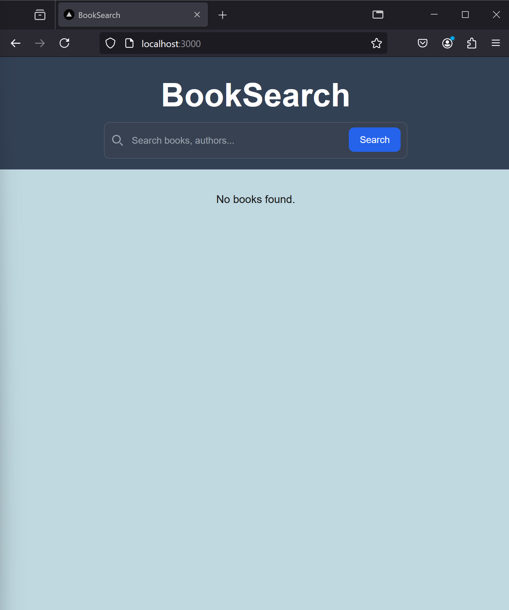
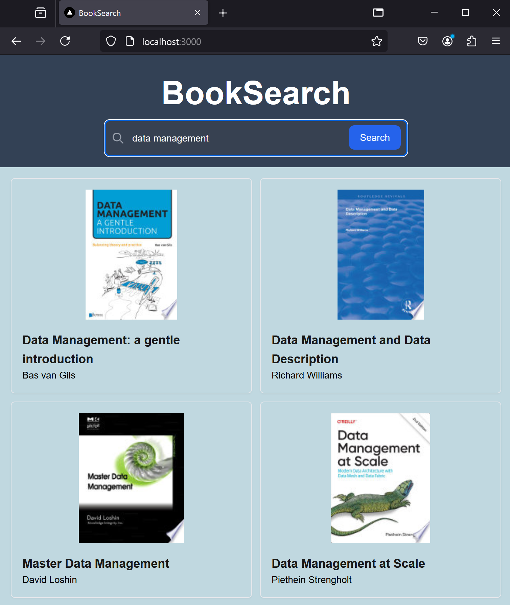
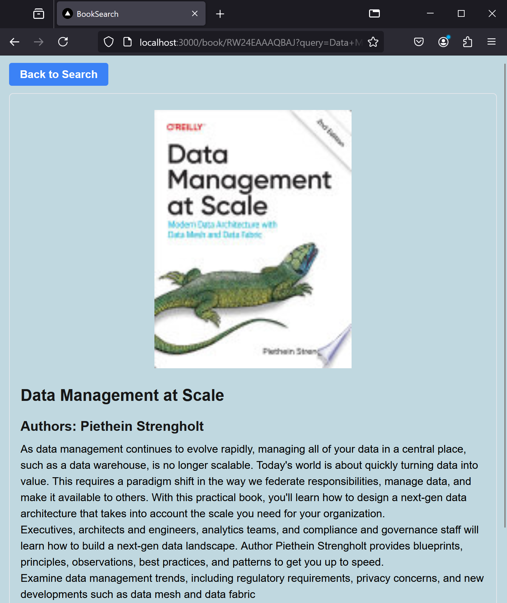
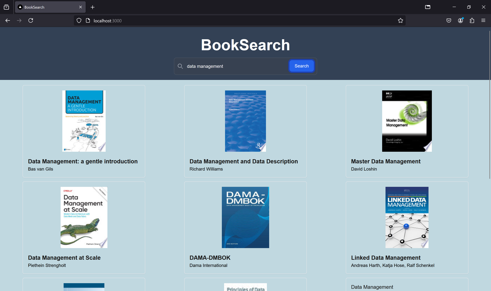
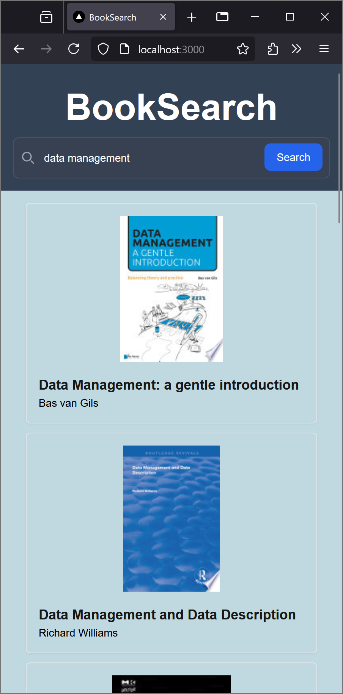

# BookSearch
This program utilizes Google Books API to search books based on user query and show matching results.
User is able to view details of the books shown in result list.

## Getting Started

To use this code, clone the repository into your local directory of your choice.

```bash
git clone github-respository-link
cd BookSearch
```
This application is run using Node.js version 20.18.0 and Next.js 14.2.15.
Please ensure that you have installed the correct Node.js version.

In the same directory, run the following commands:
```bash
npm install
npm run dev
```

Open the web application in your browser using the local host address, for example /localhost:3000.

## Things to Note
Replace the API key in .env.local.template with Google API key. Refer to [Google Book API Documentation](https://developers.google.com/books/docs/v1/using) on how to generate your own API key.

Please contact author if your API key does not work.

# Update Log
- [x] Task 1: Connect to Google Books API
- [x] Task 2: Build a search bar
- [x] Task 3: Build a search result list
- [x] Task 4: Build a books detail page
- [x] Task 5: Add responsiveness to UI


# Features
- Main Page


- Search Result


- Books Detail


- UI responsitivity



## Issues to be addressed
- User comes back to empty search result after 

## Future Improvements
- Adding a feature to persist previously availabe search result
- UI improvement